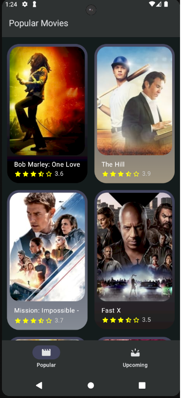
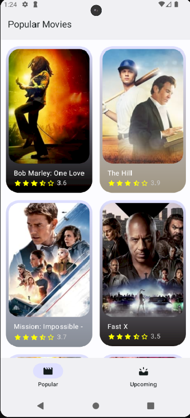

# Movie application made with Kotlin and jetpack compose using MVVM architecture

This application is made by using MVVM architecture pattern and it uses this api:
https://developer.themoviedb.org/docs/getting-started

## Screenshots

Dark theme image of the application

Light theme image of the application

